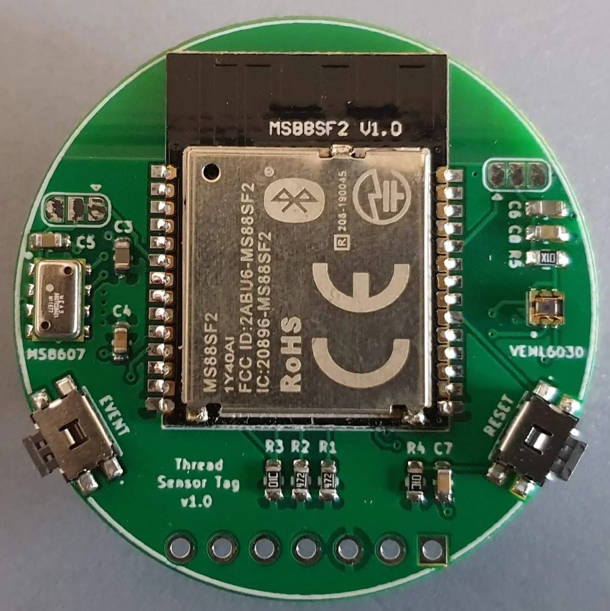

.. _nrf52840_sensortag:

nRF52840 Sensor Tag
###################

Overview
********

The nRF52840 Sensor Tag is a small board including MS8607 and VEML6030 sensors, Nordic Semiconductor nRF52840 ARM Cortex-M4F CPU and the following devices:

* :abbr:`ADC (Analog to Digital Converter)`
* CLOCK
* FLASH
* :abbr:`GPIO (General Purpose Input Output)`
* :abbr:`I2C (Inter-Integrated Circuit)`
* :abbr:`MPU (Memory Protection Unit)`
* :abbr:`NVIC (Nested Vectored Interrupt Controller)`
* :abbr:`PWM (Pulse Width Modulation)`
* RADIO (Bluetooth Low Energy and 802.15.4)
* :abbr:`RTC (nRF RTC System Clock)`
* Segger RTT (RTT Console)
* :abbr:`UART (Universal asynchronous receiver-transmitter)`
* :abbr:`WDT (Watchdog Timer)`

     nRF52840 Thread Sensor Tag (Credit: Home Smart Mesh)

Hardware
********

nRF52840 DK has two external oscillators. The frequency of the slow clock
is 32.768 kHz. The frequency of the main clock is 32 MHz.

Supported Features
==================

The nrf52840_sensortag board configuration supports the following
hardware features:

+-----------+------------+----------------------+
| Interface | Controller | Driver/Component     |
+===========+============+======================+
| ADC       | on-chip    | adc                  |
+-----------+------------+----------------------+
| CLOCK     | on-chip    | clock_control        |
+-----------+------------+----------------------+
| FLASH     | on-chip    | flash                |
+-----------+------------+----------------------+
| GPIO      | on-chip    | gpio                 |
+-----------+------------+----------------------+
| I2C(M)    | on-chip    | i2c                  |
+-----------+------------+----------------------+
| MPU       | on-chip    | arch/arm             |
+-----------+------------+----------------------+
| NVIC      | on-chip    | arch/arm             |
+-----------+------------+----------------------+
| PWM       | on-chip    | pwm                  |
+-----------+------------+----------------------+
| RADIO     | on-chip    | Bluetooth,           |
|           |            | ieee802154           |
+-----------+------------+----------------------+
| RTC       | on-chip    | system clock         |
+-----------+------------+----------------------+
| RTT       | Segger     | console              |
+-----------+------------+----------------------+
| SPI(M/S)  | on-chip    | spi                  |
+-----------+------------+----------------------+
| UART      | on-chip    | serial               |
+-----------+------------+----------------------+
| WDT       | on-chip    | watchdog             |
+-----------+------------+----------------------+

Other hardware features are not supported by the Zephyr kernel.
See `nRF52840 DK website`_ and `Nordic Semiconductor Infocenter`_
for a complete list of nRF52840 Development Kit board hardware features.

Connections and IOs
===================

Push buttons
------------

* BUTTON1 = SW1 = P1.09

Programming and Debugging
*************************

Applications for the ``nrf52840_sensortag`` board configuration can be
built, flashed, and debugged in the usual way. See
:ref:`build_an_application` and :ref:`application_run` for more details on
building and running.

References
**********

.. target-notes::

.. _SensorTag website: https://www.homesmartmesh.com/docs/microcontrollers/nrf52/thread_sensortag/
.. _Nordic Semiconductor Infocenter: https://infocenter.nordicsemi.com
.. _J-Link Software and documentation pack: https://www.segger.com/jlink-software.html
.. _nRF52840 Product Specification: http://infocenter.nordicsemi.com/pdf/nRF52840_PS_v1.0.pdf
